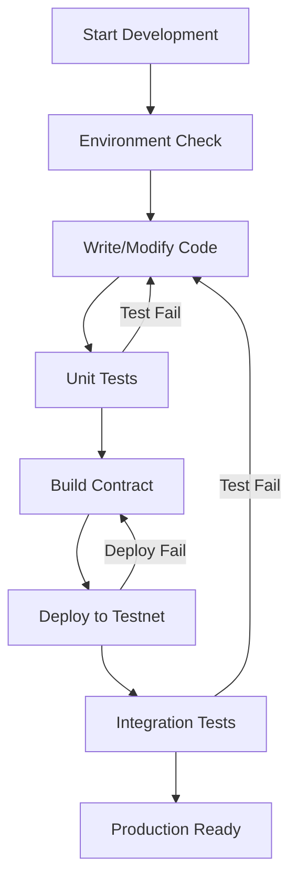

# 🌟 Stellar Digital Identity Smart Contract

> Hệ thống quản lý danh tính số phi tập trung trên blockchain Stellar sử dụng Soroban smart contracts

[](https://opensource.org/licenses/MIT)
[](https://www.rust-lang.org/)
[](https://stellar.org/)

## 📖 Tổng quan

**Stellar Digital Identity** là một smart contract được xây dựng trên blockchain Stellar, cung cấp giải pháp quản lý danh tính số an toàn, minh bạch và phi tập trung. Hệ thống cho phép người dùng:

- 🆔 Đăng ký và quản lý danh tính số
- 🔐 Kiểm soát quyền truy cập thông tin cá nhân
- ✅ Xác minh danh tính với nhiều cấp độ bảo mật
- 🔄 Cấp phát và thu hồi quyền truy cập linh hoạt
- 📊 Theo dõi lịch sử thay đổi minh bạch

## 🏗️ Kiến trúc hệ thống

### Core Components

```
📦 Stellar Digital Identity
├── 🧠 Smart Contract Logic (Rust/Soroban)
├── 🔧 Build & Deployment Tools (PowerShell)
├── 🧪 Comprehensive Testing Suite
└── 📚 Documentation & Examples
```

## 📁 Cấu trúc Project

```
stellar-digital-identity/
├── 📂 src/                         # 🎯 Core source code
│   ├── lib.rs                      # 🧠 Main smart contract logic
│   ├── test.rs                     # 🧪 Comprehensive unit tests
│   └── main.rs                     # 📍 Entry point (minimal)
├── 📂 scripts/                     # ⚙️ Deployment & management tools
│   ├── deploy.ps1                  # 🚀 Contract deployment script
│   ├── test.ps1                    # 🔍 Integration testing script
│   └── utils.ps1                   # 🛠️ Utility functions
├── 📂 target/                      # 🔨 Build artifacts (auto-generated)
├── 📂 test_snapshots/              # 📸 Test cache data (auto-generated)
├── 📋 Cargo.toml                   # 🦀 Rust project configuration
├── 📋 package.json                 # 📦 Node.js scripts configuration
├── 🔧 manage.ps1                   # 🎛️ Main management script
├── 🔧 check-build.ps1              # ✅ Environment validation script
├── 🔧 Makefile                     # 🔨 Build automation (Linux/Mac)
├── 📄 .env.example                 # 🔐 Environment variables template
├── 📄 .gitignore                   # 🚫 Git ignore patterns
└── 📜 LICENSE                      # ⚖️ MIT License
```

## 🧩 Các thành phần chính

### 1. 🎯 Smart Contract Core (`src/lib.rs`)

**Structures & Data Types:**
- `IdentityData` - Thông tin danh tính người dùng
- `AccessPermission` - Quyền truy cập và phân quyền
- `VerificationRequest` - Yêu cầu xác minh danh tính
- `EventType` - Các loại sự kiện hệ thống
- `DataKey` - Storage keys cho blockchain

**Core Functions:**
```rust
// 🏁 Contract Management
fn initialize(env: Env, admin: Address)

// 👤 Identity Management
fn register_identity(env: Env, identity_id: String, owner: Address, ...)
fn update_identity(env: Env, identity_id: String, ...)
fn deactivate_identity(env: Env, identity_id: String)

// 🔐 Access Control
fn grant_access(env: Env, identity_id: String, granted_to: Address, ...)
fn revoke_access(env: Env, identity_id: String, revoked_from: Address)
fn check_access(env: Env, identity_id: String, requester: Address)

// ✅ Verification System
fn verify_identity(env: Env, identity_id: String, verification_level: u32)

// 📊 Query Functions
fn get_identity(env: Env, identity_id: String, requester: Address)
fn get_identities_by_owner(env: Env, owner: Address)
fn get_total_identities(env: Env)
fn get_admin(env: Env)
```

### 2. 🧪 Testing Suite (`src/test.rs`)

Comprehensive test coverage bao gồm:
- ✅ Contract initialization
- ✅ Identity registration & management
- ✅ Access control mechanisms
- ✅ Verification workflows
- ✅ Permission management
- ✅ Error handling scenarios

### 3. 🛠️ Management Scripts

#### `manage.ps1` - Main Management Interface
```powershell
# Build contract
.\manage.ps1 -Action build

# Deploy to testnet
.\manage.ps1 -Action deploy -SecretKey "YOUR_SECRET_KEY"

# Run integration tests
.\manage.ps1 -Action test

# Full workflow (build + deploy + test)
.\manage.ps1 -Action full -SecretKey "YOUR_SECRET_KEY"
```

#### `scripts/deploy.ps1` - Deployment Automation
- 🔧 Environment setup và validation
- 💰 Account funding (testnet)
- 🚀 Contract deployment
- ⚙️ Contract initialization
- 📝 Configuration file generation

#### `scripts/test.ps1` - Integration Testing
- 🧪 End-to-end testing trên blockchain thực
- 👥 Multi-user scenarios
- 🔐 Access control validation
- ✅ Verification workflows

#### `scripts/utils.ps1` - Utility Functions
- 📊 Contract statistics
- 👤 User management
- 🆔 Test identity creation
- 📈 Status monitoring

## 🚀 Hướng dẫn Setup & Build

### 📋 Yêu cầu hệ thống

1. **Rust & Cargo**
   ```bash
   # Install Rust
   curl --proto '=https' --tlsv1.2 -sSf https://sh.rustup.rs | sh
   
   # Add WASM target
   rustup target add wasm32-unknown-unknown
   ```

2. **Stellar CLI**
   ```bash
   npm install -g @stellar/cli
   ```

3. **PowerShell** (Windows) hoặc **Bash** (Linux/Mac)

### 🔍 Bước 1: Kiểm tra môi trường

```powershell
# Windows
.\check-build.ps1

# Linux/Mac
make install  # Install dependencies
make check    # Validate environment
```

**Output mong đợi:**
```
✅ Rust Environment: Ready
✅ WASM Target: Installed  
✅ Dependencies: Resolved
✅ Contract Build: Successful
✅ Unit Tests: Passed
```

### 🔨 Bước 2: Build Contract

```powershell
# Windows - Using manage script
.\manage.ps1 -Action build

# Linux/Mac - Using Makefile
make build

# Manual build
cargo build --target wasm32-unknown-unknown --release
```

**Kết quả:** Contract WASM file được tạo tại:
```
target/wasm32-unknown-unknown/release/stellar_digital_identity.wasm
```

### 🧪 Bước 3: Chạy Tests

```powershell
# Unit tests
cargo test

# Integration tests (cần deploy trước)
.\scripts\test.ps1
```

### 🚀 Bước 4: Deploy lên Stellar Testnet

1. **Chuẩn bị Secret Key:**
   ```bash
   # Tạo keypair mới
   stellar keys generate alice --network testnet
   
   # Hoặc import existing key
   stellar keys add alice --secret-key "YOUR_SECRET_KEY" --network testnet
   ```

2. **Deploy Contract:**
   ```powershell
   # Windows
   .\manage.ps1 -Action deploy -SecretKey "YOUR_SECRET_KEY"
   
   # Manual deployment
   .\scripts\deploy.ps1 -SecretKey "YOUR_SECRET_KEY" -Network testnet
   ```

3. **Verify Deployment:**
   ```powershell
   # Check contract info
   .\scripts\utils.ps1 -Action info
   
   # Get contract stats
   .\scripts\utils.ps1 -Action stats
   ```

### 🔍 Bước 5: Testing End-to-End

```powershell
# Run full integration tests
.\scripts\test.ps1 -Network testnet

# Create test identity
.\scripts\utils.ps1 -Action register

# Check user identities
.\scripts\utils.ps1 -Action user
```

## 📊 Monitoring & Management

### Contract Information Files

Sau khi deploy, hệ thống tạo các file thông tin:

```json
// contract-info.json
{
  "contractAddress": "CDLZFC3SYJYDZT7K67VZ75HPJVIEUVNIXF47MA2E2ROHSXNQIAHZLJNQ",
  "adminAddress": "GBDFELLLKS7YWPP3FLSIYIGCC2XBJRKEFCM5GTEN4TIFBI6SDV63YYRZ",
  "network": "testnet",
  "rpcUrl": "https://soroban-testnet.stellar.org",
  "deployedAt": "2024-10-18 15:30:45"
}
```

### Environment Variables

```bash
# .env file
NETWORK=testnet
RPC_URL=https://soroban-testnet.stellar.org
SECRET_KEY=your_secret_key_here
CONTRACT_ADDRESS=your_deployed_contract_address
ADMIN_ADDRESS=your_admin_address
```

## 🔐 Security Features

- **🔒 Multi-level Verification** (0-3 levels)
- **⏰ Time-based Access Control** với expiration
- **👑 Admin-only Functions** cho verification
- **🛡️ Owner-only Permissions** cho identity management
- **📝 Audit Trail** thông qua blockchain events

## 🧪 Testing Scenarios

Contract được test với các scenarios:

1. **Basic Functionality**
   - Contract initialization
   - Identity registration
   - Data retrieval

2. **Access Control**
   - Permission granting/revoking
   - Time-based expiration
   - Unauthorized access prevention

3. **Verification Workflow**
   - Admin verification process
   - Level-based verification
   - Status tracking

4. **Error Handling**
   - Invalid inputs
   - Unauthorized operations
   - Edge cases

## 🐛 Troubleshooting

### Common Issues & Solutions

1. **Build Errors**
   ```bash
   # Clean and rebuild
   cargo clean
   cargo build --target wasm32-unknown-unknown --release
   ```

2. **Deployment Failures**
   ```bash
   # Check network connectivity
   stellar network status --network testnet
   
   # Verify account funding
   stellar account info --address YOUR_ADDRESS --network testnet
   ```

3. **Test Failures**
   ```bash
   # Reset test environment
   rm -rf test_snapshots/
   cargo test
   ```

## 📈 Performance & Optimization

- **Contract Size:** ~150KB WASM optimized
- **Gas Efficiency:** Optimized storage patterns
- **Scalability:** Efficient data structures
- **Caching:** Incremental build support

## 🔄 Development Workflow



## 📚 Advanced Usage

### Custom Network Deployment

```powershell
# Deploy to custom network
.\scripts\deploy.ps1 -Network mainnet -RpcUrl "https://your-rpc-url.com"
```

### Batch Operations

```powershell
# Register multiple test identities
for ($i=1; $i -le 5; $i++) {
    .\scripts\utils.ps1 -Action register
}
```

### Contract Monitoring

```powershell
# Continuous monitoring
while ($true) {
    .\scripts\utils.ps1 -Action stats
    Start-Sleep 30
}
```

## 🤝 Contributing

1. Fork the repository
2. Create feature branch: `git checkout -b feature/amazing-feature`
3. Commit changes: `git commit -m 'Add amazing feature'`
4. Push to branch: `git push origin feature/amazing-feature`
5. Open Pull Request

## 📝 License

This project is licensed under the MIT License - see the [LICENSE](LICENSE) file for details.

## 🔗 Resources

- [Stellar Developer Portal](https://developers.stellar.org/)
- [Soroban Documentation](https://soroban.stellar.org/)
- [Rust Programming Language](https://www.rust-lang.org/)
- [Stellar CLI Documentation](https://developers.stellar.org/docs/tools/cli)

## 📞 Support

Để được hỗ trợ:
1. Tạo issue trên GitHub repository
2. Kiểm tra [Stellar Developer Discord](https://discord.gg/stellardev)
3. Xem [Soroban Examples](https://github.com/stellar/soroban-examples)

---

**Built with ❤️ for the Stellar ecosystem**